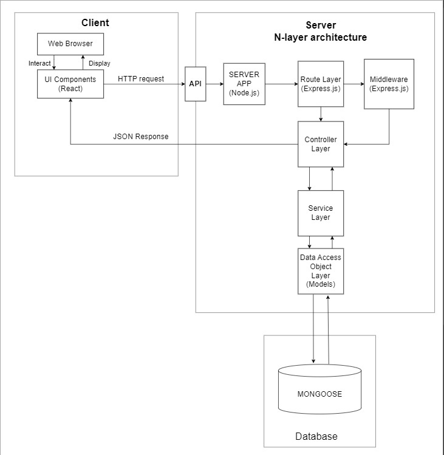

# ChoreKeeper

## Team
Team Name: Group 14

Members:
- Joshua Dueck, dueckj1@myumanitoba.ca, JoshuaDueck
- Syed Ali Jafry, aliahses@myumanitoba.ca, Ahsen19
- Kimberly Wills, willsk@myumanitoba.ca, Amikz
- Abdulraheem Tiamiyu, tiamiyao@myumanitoba.ca, Tosvng

## Project Summary and Vision
Our vision is to provide an organized and user-friendly solution that helps people efficiently manage their responsibilities.

For busy individuals or individuals who find it hard to stay on top of their tasks, our chore-tracking application is designed to make managing tasks and responsibilities effortless and organized. It enables individuals to stay on top of their chores, providing a clear view of what needs to be done.
 
Our application is user-friendly, customizable, and adaptable to individual needs and preferences, ensuring a stress-free and productive lifestyle for all users. With real-time notifications, the app makes sure you are always on top of your chores, and never miss an important task again.

With the ability to create tasks on the go, you will never have to worry about forgetting to do something again, or having to rely on your memory to remember what needs to be done. Whether you're at home, on the go, or out running errands, you can easily create new tasks and add them to your to-do list. With our application, all your tasks are stored in one central location, accessible from any device with internet access.

We want our application to be a vehicle for behavior change. Many people find it difficult to plan their responsibilities effectively. Hence, the criteria of success for this project will hinge on its aptness to motivate whilst keeping the user accountable. The project will be judged as successful if over 75% of users report an increase in productivity over a period of one week.

## Core Features
- Create, update, and delete chores
- View and manage a list of chores
- Create and manage account
- Receive notifications regarding chores
- Can response 100 users with 1000 requests per minute concurrently

## Technologies
#### Frontend:
- React.js

#### Backend: 
- Express.js

#### Database:
- MongoDB

#### Docs and Ticket Tracking:
- [Jira](https://keepers.atlassian.net/jira/software/projects/CK/boards/1)
- [Confluence](https://keepers.atlassian.net/wiki/spaces/CK/pages/524292/Meeting+Notes)

#### Version Control and CI/CD
- [Github](https://github.com/Group14-TeamTidy/ChoreKeeper)
- Github Actions

## User Stories

### Create, update, and delete chores
- As a busy person, I want to be able to create, update, and delete chores so that I can keep track of the chores that I need to complete
- Scenario: User compiles their chores in the system
    
    Given that I need to complete some chores\
    when I click the "add" button and fill in the information for a chore\
    then the chore is created in the system\
    and the chore is added to a chore list\
    when I click on an existing chore\
    then I can view the information I inputted for that chore\
    and the system shows an "edit" button for that chore\
    when I click the "edit" button, change the information, and save it\
    then the chore is updated in the system\
    when I click the "delete" button on a chore\
    then the chore is removed from the system

### View and manage a list of chores
- As a busy person, I want to be able view and manage a list of chores per day, week, month, etc. so that I can organize and priorities my chores
- Scenario: User manages a list of chores so that they can organize their time

    Given that I have entered my chores into the system\
    when I go to the main page\
    then I can see my chores in a list\
    and the system shows a "sort" button and a "filter" button\
    when I click the "sort" button and select a sort criteria, such as due date and time\
    then the list of chores is sorted\
    when I click a "filter" button and select a filter criteria, such as for the day\
    then the list of chores is filtered\
    when I complete a chore and click the box next to it\
    then the chore is "checked off" and marked as completed in the system

### Create and manage account
- As a busy person, I want to be able to create an account so that I can access my schedule from anywhere
- Scenario: User creates and manages an account

    Given that I would like to manage my chores\
    when I click the "create account" button and complete the information\
    then my account is created in the system\
    and I will be logged in for the first time\
    when I click on my account details\
    then I can view and edit my account information\
    when I click the logout button\
    then I will be logged out of my account

### Receive notifications regarding chores
- As a signed-in user, I want to be able to get notifications about upcoming chores so that I do not forget to complete them
- Scenario: User sets up notifications to be received to remind them about their chores

    Given that I am a signed-in and have entered my chores into the system with specified notification times\
    when I navigate to the notifications settings and input my phone number or email\
    then I receive a text or email notification when my chore needs to be completed

### Project Architecture

